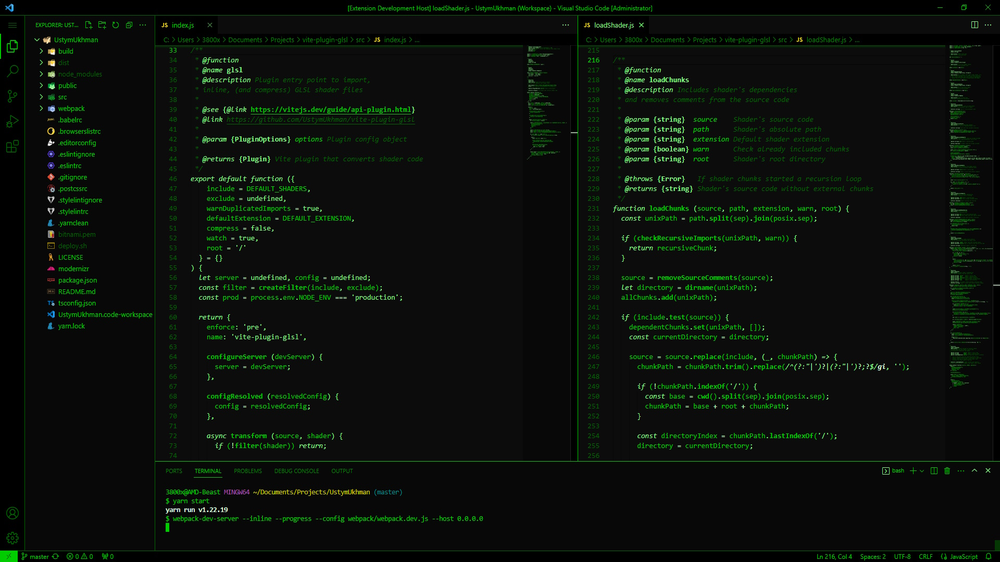
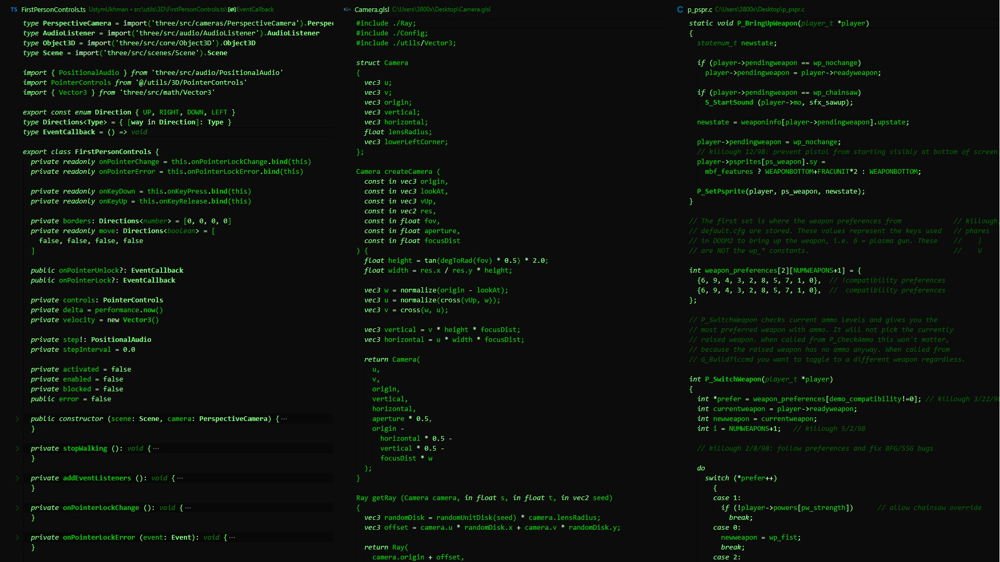

# 🖥️ Matrix Theme

> Visual Studio Code color theme inspired by [**The Matrix**](https://en.wikipedia.org/wiki/The_Matrix) film.

## Preview

## Installation

1. Install and Launch [Visual Studio Code](https://code.visualstudio.com/)
2. **Manage** > **Extensions** (or `Ctrl+Shift+X`)
3. Search for `matrix-theme`
4. Click **Install**
5. **Manage** > **Color Theme** > **Matrix**

## Misc

This is my first foray into creating a theme, so if you see something amiss, please feel free to [file an issue](https://github.com/UstymUkhman/matrix-theme/issues). Any relevant changes for each version are documented in the [changelog](https://github.com/UstymUkhman/matrix-theme/blob/master/CHANGELOG.md), please check it out before filing any issues.
